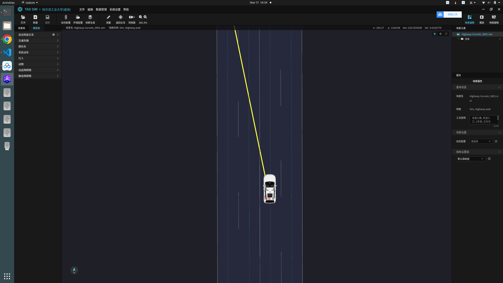

# <div align="center">tadsim_visual</div>

<div align="center">
    <!-- an image which can properly describe this repository -->
    <!-- images are stored under .github/images -->
    
    <p>
    腾讯TAD SIM自动驾驶仿真软件视觉仿真示例.
    </p>


简体中文 | [English](.github/README_en.md)

</div>

## <div align="center">前期基础</div>
<!-- setting details to open will display all below  -->
<details open>
<summary>环境依赖</summary>

<!-- names of dependencies and websites if had -->
- [OpenCV 3.4.16](https://opencv.org/releases/)
- [Ubuntu 20.04.06 LTS](https://ubuntu.com/download/alternative-downloads)
- [ROS Noetic](https://wiki.ros.org/noetic/Installation/Ubuntu)
- tadsim 2.87.1624

    <!-- some details about environment if needed -->  

</details>

<details open>
<summary>快速上手</summary>

1. 在本地主机上安装好上述环境依赖;
   
2. 进入本地ROS工作空间下的/src文件夹，克隆visual示例并编译
    ```bash
    git clone git@github.com:255isWhite/VisuaLidar.git
    catkin_make -DCATKIN_WHITELIST_PKGS=tadsim_visual
    ```

3. 打开tadsim完成模块加载
    <!-- ```bash
    cd YOUR_GIT_PATH/VisuaLidar
    ./build.sh
    roscore&
    rosrun VisuaLidar Mono_Inertial Vocabulary/ORBvoc.txt config/custom.yaml
    ```

4. Play your ROS bag and do not forget to remap the essential topics, for example
    ```bash
    rosbag play --pause imu_encoder_image.bag /usb_cam/image_raw:=/camera/image_raw /wit/imu:=/imu 
    ``` -->

</details>

<details open>
<summary>To Do List</summary>
  
- Add Docker usage


</details>

<!-- <details off>
<summary>Anything you wanna add here</summary>
Some descriptions for this.

</details>

## <div align="center">Anything you wanna add here</div>
<details open>
<summary>Anything</summary>

<p>To be done</p>

</details>

<details open>
<summary>Anything</summary>
<p>To be done</p>
</details>

<details open>
<summary>Anything</summary>
<p>To be done</p>
</details> -->

## <div align="center">Contact</div>
Welcome all questions in issues tag or if u wanna contact me at nocap.wzh@gmail.com