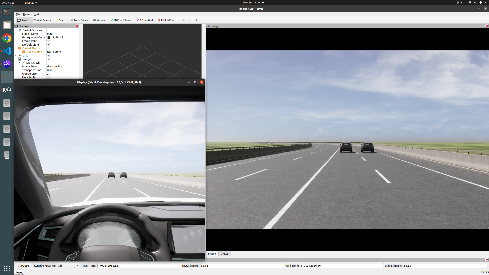
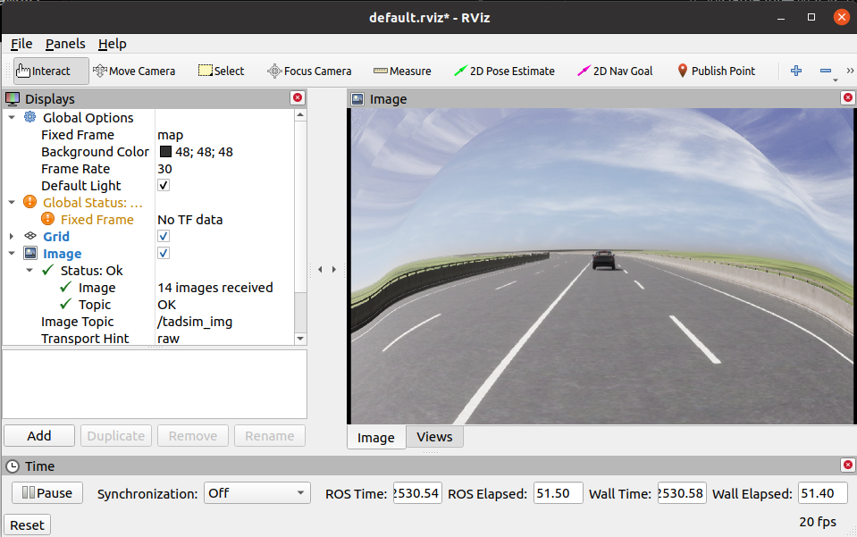
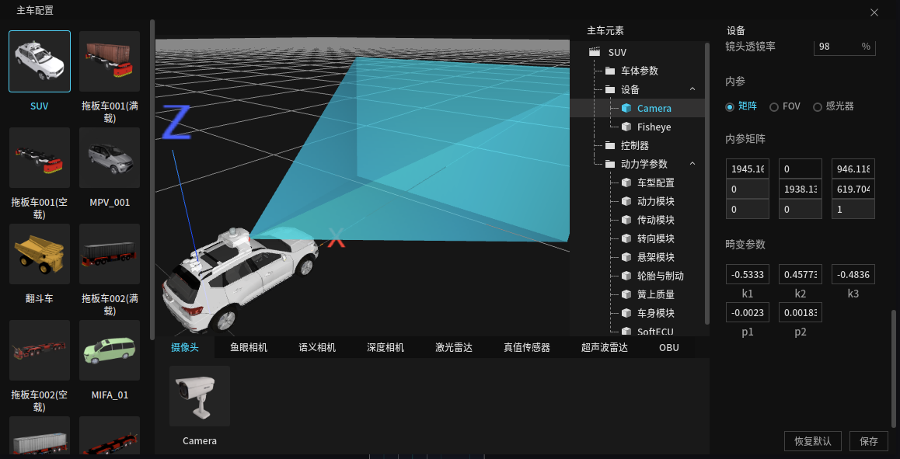
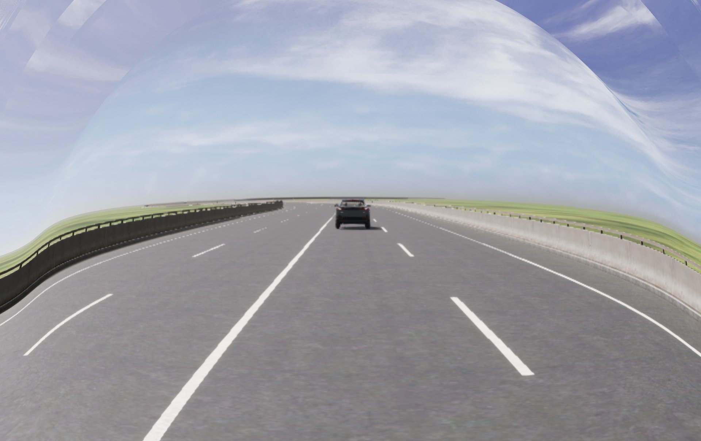
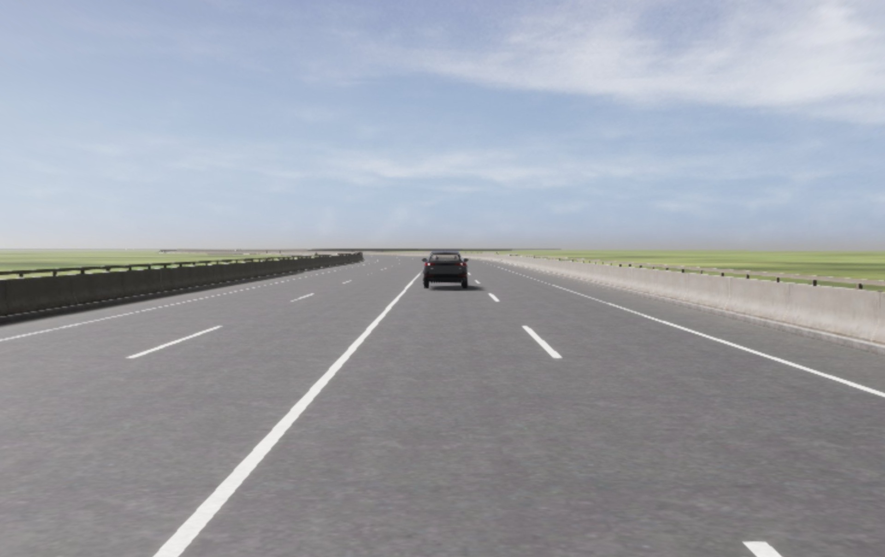

# <div align="center">tadsim_visual</div>

<div align="center">
    <!-- an image which can properly describe this repository -->
    <!-- images are stored under .github/images -->
    
    <p>
    腾讯TAD SIM自动驾驶仿真软件视觉仿真示例.
    </p>


简体中文 | [English](.github/README_en.md)

</div>

## <div align="center">前期基础</div>
<!-- setting details to open will display all below  -->
<details open>
<summary>环境依赖</summary>

<!-- names of dependencies and websites if had -->
- [OpenCV 3.4.16](https://opencv.org/releases/)
- [Ubuntu 20.04.06 LTS](https://ubuntu.com/download/alternative-downloads)
- [ROS Noetic](https://wiki.ros.org/noetic/Installation/Ubuntu)
- tadsim 2.87.1624

    <!-- some details about environment if needed -->  

</details>

<details open>
<summary>快速上手</summary>

1. 在本地主机上安装好上述环境依赖;
   
2. 进入本地ROS工作空间下的/src文件夹，克隆visual示例并编译
    ```bash
    git clone git@github.com:255isWhite/tadsim_visual.git
    ## or 
    git clone https://github.com/255isWhite/tadsim_visual.git
    ```
    ```
    catkin_make -DCATKIN_WHITELIST_PKGS=tadsim_visual
    ```

3. 配置TAD Sim
    ```bash
    ## 在终端打开tadsim
    tadsim
    ```

    Display配置
    ```bash
    # 完全关闭TAD Sim后再进行下述操作
    cd /home/$USER/.config/tadsim/data/service_data/Display/Saved/Config/LinuxNoEditor
    gedit Game.ini
    ```
    - 向Game.ini中加入以下内容（若不存在该文件，请成功运行一次Display模块后再尝试）
    ```bash
    [Sensor]
    # 是否向外发送传感器数据
    PublicMsg=true 
    # 是否存储相机图像
    # 若存储，路径为/home/$USER/.config/tadsim/data/service_data/Display/Saved/SensorData
    CameraSaved=true
    ```

    自定义模块
    - 模块名称：**CameraIO**
    - 可执行文件路径：功能包编译后生成的可执行文件，例如/home/robot/catkin_ws/devel/lib/tadsim_visual/camera_node
    - 依赖路径：["/lib/x86_64-linux-gnu","/opt/tadsim/resources/app/service/simdeps","/opt/ros/noetic/lib/"]
    - 初始化参数：Height=1208（**手动换行**）Width=1920

    模组配置
    - 确保包含Display和CameraIO模块

    主车配置
    - 确保主车搭载摄像头，分辨率为1920*1208，建议摄像头位置(x,y,z)为(150,0,180)

4. 接口运行

    TAD Sim内选定场景点击运行，在下方终端内选择CameraIO选项卡，可以查看相关程序输出。
    ```bash
    rviz -d catkin_ws/src/tadsim_visual/config/image.rviz 
    ```
    此时在Rviz窗口内可以接收到话题为/tadsim_img的图像数据了，若未能成功，请检查上述步骤。
    


</details>

<details open>
<summary>已知Bug</summary>
  
- TAD Sim必须在终端内输入tadsim启动，否则会和ROS相关环境变量发生冲突


</details>

## <div align="center">示例1：深入了解相机畸变模型</div>
<!-- setting details to open will display all below  -->
<details open>
<summary>示例背景</summary>
 
  - TAD Sim可以对相机模型进行仿真，包括相机的分辨率，及其对应的内参矩阵和畸变参数，因此我们可以自定义一个独特的的相机模型，并利用这些畸变参数体会相机的畸变矫正操作。

    
</details>

<details open>

<summary>快速上手</summary>
  
1. 修改主车搭载的相机模型的畸变参数（注意：不宜过大）,下图是(k1,k2,k3,p1,p2)为(-1,0.5,0.1,0.1,0.01)时，可以看出原始图像已有十分明显的畸变效果了。
    

2. 在**src/CameraFun.cc**中找到有关**示例一**的注释，利用已知的畸变参数，借助OpenCV库，对接收到的图像数据进行实时矫正并发布。

3. 对比矫正前后的图像，体会图像矫正的必要性。(Tips: images/raw.jpg为程序自动存储的接收到的最新一帧图像) 
    

</details>

<details open>

<summary>动手实践</summary>
  
- 通过任何途径获得一张未经矫正的相机原始图像，利用Matlab提供的相关工具进行相机内参标定[（参考链接）](https://cloud.tencent.com/developer/article/2080705)，得到内参矩阵和畸变参数，对比体会图像较正效果。

</details>


## <div align="center">Contact</div>
Welcome all questions in issues tag or if u wanna contact me at nocap.wzh@gmail.com